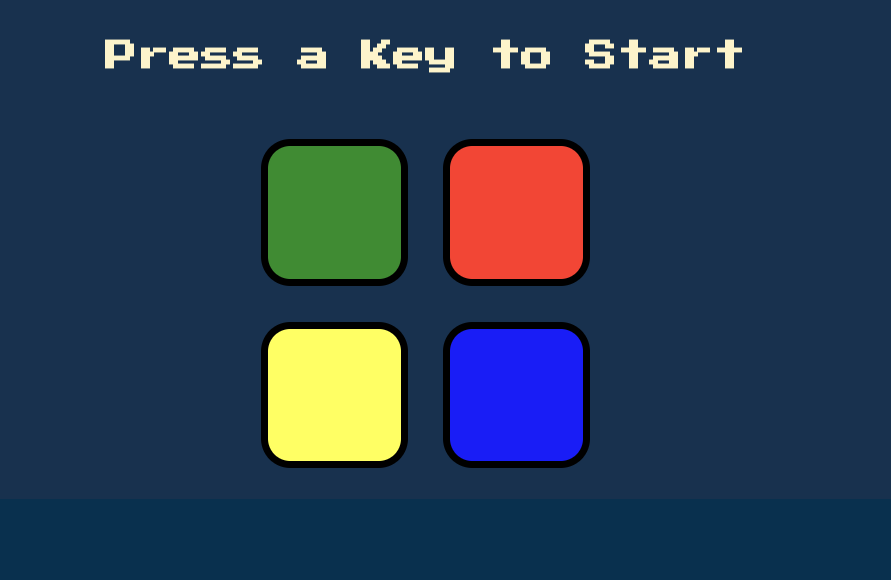

# Simon Game

# Challenges I Faced? 

I struggle with some of the JavaScript logic for the game. I’m fairly new to JavaScript and some of these concepts seem a 
little bit more advanced than I’m used to. Like playing sound using JavaScript, incorporating the keyboard within the game, 
and using the Jquery library. 

# How Did I Overcome Those Challenges? 

I tried to think more programmatically as I approached this project, I stumbled upon this concept in prior research, and 
to put it loosely it’s the idea of breaking down a problem into bite size pieces and tackling each issue step-by-step. 

The more formal term is “computational thinking” and the wiki definition is: 

A set of problem solving methods that involve expressing problems and their solutions in ways that a computer could execute. It involves the mental skills and practices for designing computations that get computers to do jobs for us, and explaining and interpreting the world as a complex of information processes. 

With this in mind I approach this project with a very meticulous foresight. Trying to think of not only what needed to happen and when but how it needed to happen in order to generate a positive user experience. I drew out the logic for the game in common English on a whiteboard before I started coding to get a general idea of the flow of the computational thought process.

By doing research on platforms like Google,YouTube, MDN docs, stack overflow, github, online courses, and reference guides, not only was able to finish coding the program successfully but I was also able to explain what I did and why I did at each step in the process. 

# What Did I Learn? 

* How to work with arrays in JavaScript
* How to work with boolean values in JavaScript
* How to use the jQuery library to incorporate the keyboard in a JavaScript program
* How to incorporate a mouse click in my JavaScript programs
* How to play sound using JavaScript
* How to think from the end-users point of view 
* How do use HTML more efficiently
* How do you CSS more efficiently
* How to write JavaScript functions
* How to use JavaScript methods
* How to set up the flow of a program more efficiently and effectively
* How to use CSS grid

